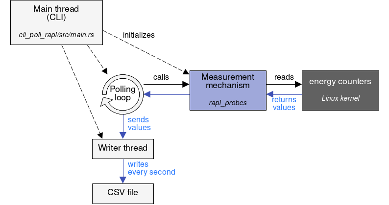

# Minimal RAPL-based measurement tool in Rust

This is a minimal tool that measures the energy consumption of a CPU, on Linux, through all possible RAPL interfaces.


Architecture of the software

## Research paper

This software has been made for the following article: *Dissecting the software-based measurement of CPU energy consumption: a comparative analysis*, Guillaume Raffin\*† and Denis Trystram\*, 2024.

In this article, we show that measuring the energy consumption with the RAPL (Running Average Power Limit) technology can be tricky. In particular, we highlight some pitfalls in existing RAPL-based software measurement tools. We open the "black box" of RAPL and provide an in-depth analysis of th different ways of accessing RAPL measurements. Applications include: energy profiling, HPC energy monitoring with minimal performance overhead and maximal frequency (around 1000 Hz), etc.

The minimal measurement tool contained in this repository avoids the pitfalls that we detected. It has enabled us to provide a quantitative assessment of the overhead of each mechanism. It also allowed us to compare the mechanisms in a qualitative way. 

You can find the article here:
- IEEE Transactions on Parallel and Distributed Systems (coming soon)
- [ArXiv link](https://doi.org/10.48550/arXiv.2401.15985), [HAL link](https://hal.science/hal-04420527) (preprint)

Affiliations:
- \* Univ. Grenoble Alpes, CNRS, Inria, Grenoble INP, LIG, 38000 Grenoble, France
- † Bull SAS (Eviden, Atos group), France

## How to use

### Requirements (5 minutes)

- **OS**: Linux (any distribution)
- **CPU**: x86_64 CPU, Intel (built in 2013 or newer) or AMD (of the Zen family or newer). I
- **Software**: Rust with the musl toolchain (see below)
- **Dataset**: none (this software generates a dataset)

The measurement tool is built in Rust, hence you need to [install Rust via rustup](https://rustup.rs/).

Make sure that you have the `x86_64-unknown-linux-musl` toolchain installed by running the following command:
```sh
rustup target add x86_64-unknown-linux-musl
```

Note: the tool can work on laptops and bigger devices (e.g. HPC nodes).

### Compilation (< 1 minute)

Clone the repository and run the following command in the repository folder:
```sh
cargo build --release
```

If you encounter a bug, you can remove the `--release` flag to enable the "debug" mode. To replicate our research work, the debug mode should not be used, because it decreases the performance of the tool.

### Deployment (< 1 minute)

The compilation process generates a single, statically linked binary, without any dependency. It can be copied to any x86_64 Linux machine (for example via `scp`).
The binary is located at `./target/x86_64-unknown-linux-musl/release/cli_poll_rapl`.

### Running the tool

The tool requires high privileges to run. The easiest way to do that is to run it as root, like this:

```sh
sudo -E ./target/x86_64-unknown-linux-musl/release/cli_poll_rapl poll powercap --domains pkg --frequency 1 --output file --output-file results.csv
```

With the above command, we continuously poll measurements
- with the `powercap` mechanism
- from the RAPL register that corresponds to the `package` (pkg) domain
- with a frequency of 1 Hz (1 measurement per second)
- and we save the result to `results.csv`

You need to **stop the tool manually** with Ctrl+C after some time. To reproduce the experiments of the paper, we recommend to write a Bash script that kills the tool's process when the CPU-bound benchmark exits.

### Format of the CSV result

Example of CSV produced by `cli_poll_rapl`:

```
timestamp_ms;socket;domain;overflow;joules
1732110377710;0;Package;false;1.39758
1732110378709;0;Package;false;1.2421229999999999
1732110379709;0;Package;false;2.1536809999999997
1732110380709;0;Package;false;2.557061
1732110381710;0;Package;false;5.631822
```

Description of the fields:
- `timestamp_ms`: Unix timestamp in milliseconds since 01/01/1970
- `socket`: id of the CPU socket that is measured (if you have only one CPU, it will always be zero)
- `domain`: RAPL domain that is measured
- `overflow`: true if the low-level RAPL register has overflowed (in which case the overflow is corrected by applying the formula specified in the research article), false otherwise
- `joules`: energy consumed since the previous measurement (of the same domain and socket), in Joules

You can use `--help` to learn about the possible options.

### Optional: how to use eBPF

By default, the eBPF implementation is disabled (not compiled, not included in the generated binary) because it requires additional system and crate dependencies.
To enable it as we did for the paper, see [ebpf_common/README.md](ebpf_common/README.md).

Most of the results can still be reproduced without eBPF.

## License

Licensed under the EUPL 1.2 or later (The EUPL is compatible with many other licences, including GPL and LGPL, don't hesitate to contact us by email if you have concerns about it).

## What's next?

Hey! If you like this project, please check out the next episode here: [Alumet, a customizable and efficient tool for distributed energy consumption measurement](https://github.com/alumet-dev/alumet). Scientific publication pending.
